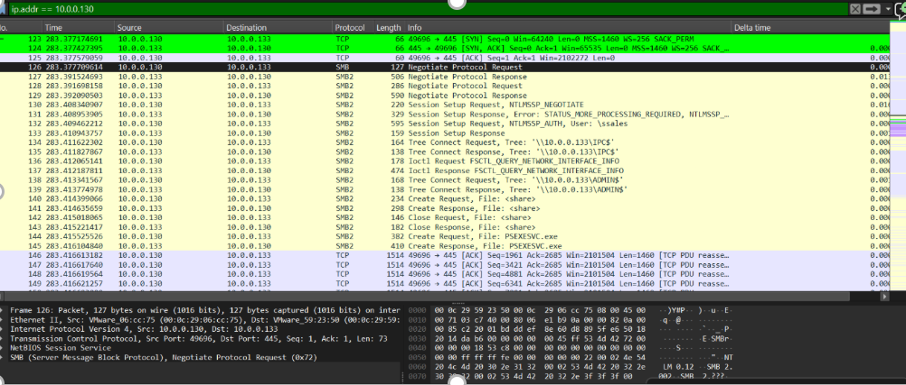
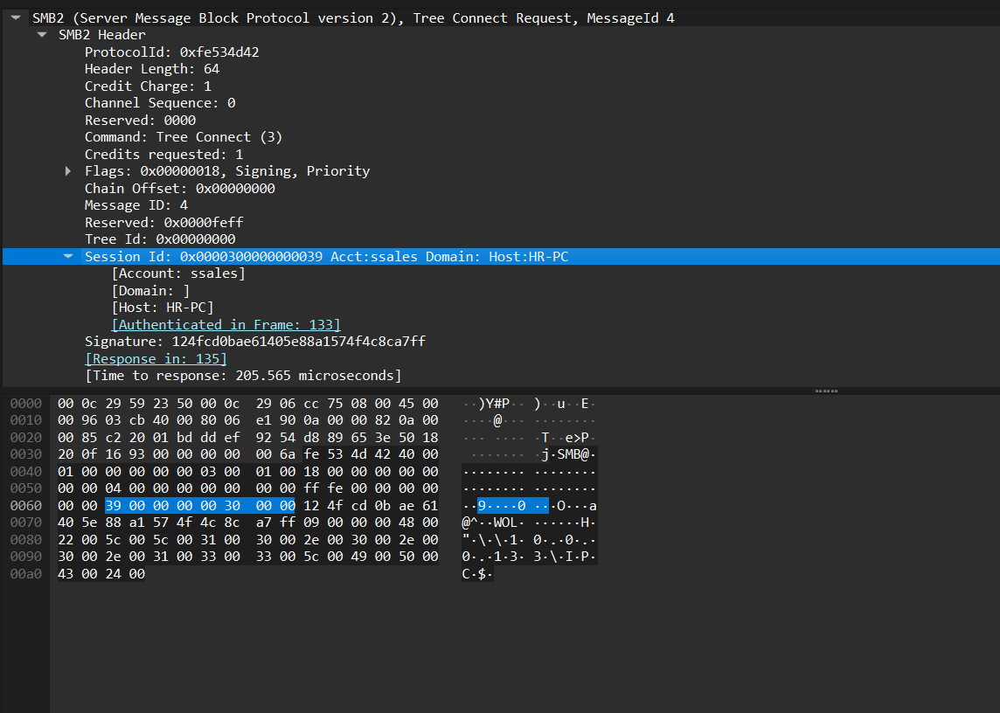
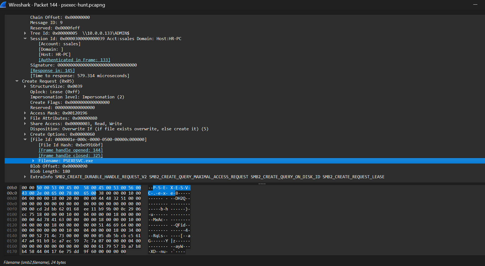
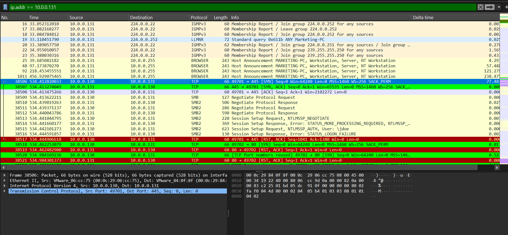
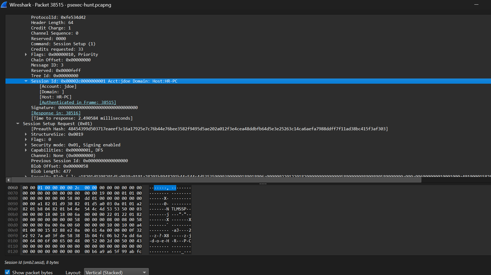

# Suspicious Lateral Movement Investigation Involving PsExec

## Overview

This lab focuses on identifying suspicious lateral movement activity using PsExec within a Windows environment. 
The investigation was conducted by analyzing SMB traffic from a provided PCAP file in Wireshark.
PsExec is a legitimate Microsoft Sysinternals tool commonly used for remote administration and process execution. 
However, attackers frequently abuse it for Living off the Land (LotL) attacks because it uses trusted Windows components such as:
- SMB (Server Message Block)
- Remote Service Control Manager
## Objectives
The goal of this investigation was to identify:
- The attacker and victim systems
- Compromised user credentials
- Administrative share access
- Evidence of PsExec deployment
- Lateral movement behavior across the network
## Tools Used
- Wireshark
- SMB protocol analysis
- PCAP traffic analysis
- Windows networking concepts
## Investigation Process
1. Connection Establishment
The analysis began with a TCP 3-way handshake on port 445 (SMB).
### Key observation
- 10.0.0.130 initiated the connection to 10.0.0.133.
This indicates that 10.0.0.130 was actively targeting the SMB service on 10.0.0.133.

2. Authentication and Credential Validation
The attacker negotiated the SMB protocol and authenticated using NTLM.
### Key evidence
- Packet 132: Session Setup Request, NTLMSSP_AUTH
- User account: \vsales
The corresponding Session Setup Response indicated a successful login, confirming the attacker possessed valid credentials.
Screenshot
3. Administrative Access Verification
After authentication, the attacker accessed administrative shares:
- IPC$ – used for inter-process communication and system enumeration
- ADMIN$ – requires administrative privileges
Successful access to \\10.0.0.133\ADMIN$ confirmed that the vsales account had local administrator rights on the target system.

4. PsExec Payload Deployment
The most critical evidence was the transfer of PSEXESVC.exe, the service executable used by PsExec.
### Key evidence
- Packet 144: SMB2 Create Request for PSEXESVC.exe
- Subsequent Write Requests transferred the executable to the target system
This sequence demonstrates the attacker deploying PsExec to establish remote command execution capabilities.

### Key Findings

| Finding |	Details |
|---------|---------|
| Attacker IP | 10.0.0.130 |
| Victim IP | 10.0.0.133 |
| Victim IP | 10.0.0.131 |
| Compromised Account | vsales |
| Compromised Account | jdoe |
| Privileges | Local Administrator|
| Tool Used | PsExec
| Technique	| Lateral Movement via SMB and Remote Service Execution |

## MITRE ATT&CK Mapping
- T1021.002 – SMB/Windows Admin Shares
- T1569.002 – Service Execution
- T1078 – Valid Accounts
- T1105 – Ingress Tool Transfer
## Conclusion
The packet capture reveals a classic lateral movement attack using PsExec. The attacker successfully:
- Authenticated with valid credentials (vsales)
- Verified administrative access through the ADMIN$ share
- Uploaded the PSEXESVC.exe service executable via SMB
- Prepared the target system for remote command execution using DCERPC and SMB
This activity strongly indicates that the attacker gained administrative control of the target system and established a foothold for further movement within the network.

PCAP Analysis screenshots.

